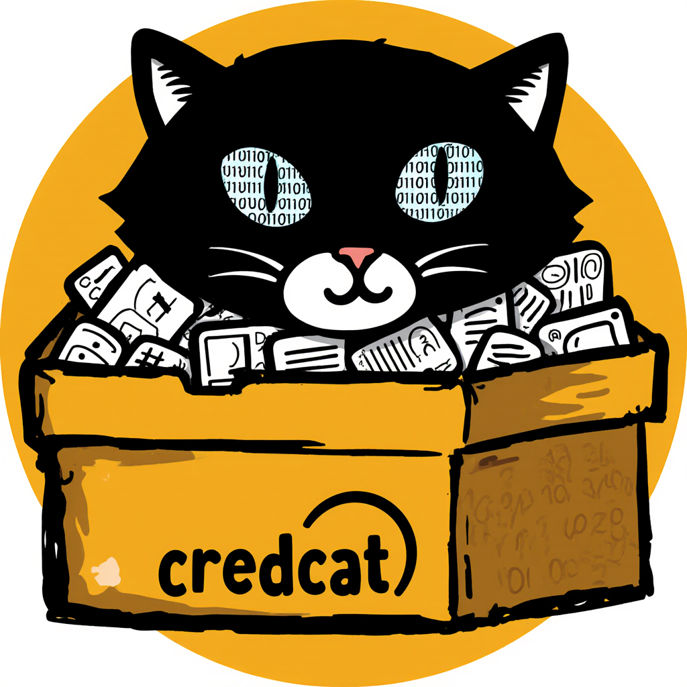

<a id="readme-top"></a>


<!-- PROJECT SHIELDS -->
<!--
*** I'm using markdown "reference style" links for readability.
*** Reference links are enclosed in brackets [ ] instead of parentheses ( ).
*** See the bottom of this document for the declaration of the reference variables
*** for contributors-url, forks-url, etc. This is an optional, concise syntax you may use.
*** https://www.markdownguide.org/basic-syntax/#reference-style-links
-->
[![Contributors][contributors-shield]][contributors-url]
[![Forks][forks-shield]][forks-url]
[![Stargazers][stars-shield]][stars-url]
[![Issues][issues-shield]][issues-url]
[![project_license][license-shield]][license-url]


<!-- PROJECT LOGO -->
<br />
<div align="center">
  <a href="https://github.com/byteskeptical/credcat">
    
  </a>

<h3 align="center">credcat</h3>

  <p align="center">
    Bound by sacred cyphers and powered by forgotten rites; access without a path, only a destination. Your vital sigils safe, their essence known to none but their holder, sealed by the magic of pure ignorance.
    <br />
    <a href="https://github.com/byteskeptical/credcat"><strong>Explore the docs »</strong></a>
    <br />
    <br />
    <a href="https://github.com/byteskeptical/credcat/issues/new?labels=bug">Report Bug</a>
    &middot;
    <a href="https://github.com/byteskeptical/credcat/issues/new?labels=enhancement">Request Feature</a>
  </p>
</div>


<!-- TABLE OF CONTENTS -->
<details>
  <summary>Table of Contents</summary>
  <ol>
    <li>
      <a href="#about-the-project">About The Project</a>
      <ul>
        <li><a href="#built-with">Built With</a></li>
      </ul>
    </li>
    <li>
      <a href="#getting-started">Getting Started</a>
      <ul>
        <li><a href="#prerequisites">Prerequisites</a></li>
        <li><a href="#installation">Installation</a></li>
      </ul>
    </li>
    <li><a href="#usage">Usage</a></li>
    <li><a href="#roadmap">Roadmap</a></li>
    <li><a href="#contributing">Contributing</a></li>
    <li><a href="#license">License</a></li>
    <li><a href="#contact">Contact</a></li>
    <li><a href="#acknowledgments">Acknowledgments</a></li>
  </ol>
</details>


<!-- ABOUT THE PROJECT -->
## About The Project

Extending access to Keeper secrets manager for api retrival in
distributed or disconnected processes. Serves as a quality of life
abstraction to diminish the scourge of hard-coded, insecurely
handled credentials in our code bases.

<p align="right">(<a href="#readme-top">back to top</a>)</p>


### Built With

* [![Java][java-shield]][java-url]

_Java is like a bad relationship. It's too object-oriented_

<p align="right">(<a href="#readme-top">back to top</a>)</p>


<!-- GETTING STARTED -->
## Getting Started

Compiling is not necessary as release binaries are available. If
you're so inclined the sections below are for you.

### Prerequisites

Your going to need a compiler, I recommend anything not Oracle java.
Depending on your os, the installation process will vary. Additional
packages like maven will be needed to utilize the provided pom file.

#### CentOS
* bash
  ```sh
  sudo dnf install java-21-openjdk java-21-openjdk-devel maven
  ```

#### Debian
* bash
  ```sh
  sudo apt install maven openjdk-21-jdk-headless
  ```

#### Ubuntu
* bash
  ```sh
  sudo apt install maven openjdk-21-jdk-headless
  ```

#### Windows
* powershell
  ```powershell
  winget install maven
  winget install Microsoft.OpenJDK.21
  refreshenv
  ```

  ```powershell
  $jdk_url = "https://aka.ms/download-jdk/microsoft-jdk-21-windows-x64.msi"
  $java_home = New-Item -ItemType Directory -Path "$env:ProgramFiles\Java" -Force
  $maven_home = New-Item -ItemType Directory -Path "$env:ProgramFiles\Apache\Maven" -Force
  $maven_version = "3.9.11"
  $maven_url = "https://dlcdn.apache.org/maven/maven-3/$maven_version/binaries/apache-maven-$maven_version-bin.zip"
  Start-BitsTransfer -Destination "$env:USERPROFILE\Downloads\jdk-21.msi" -Source $jdk_url
  Start-BitsTransfer -Destination "$env:USERPROFILE\Downloads\maven.zip" -Source $maven_url
  Start-Process -Wait -FilePath msiexec -ArgumentList /i, "$env:USERPROFILE\Downloads\jdk-21.msi", "ADDLOCAL=FeatureMain,FeatureEnvironment,FeatureJarFileRunWith,FeatureJavaHome", 'INSTALLDIR="$java_home"', /quiet -Verb RunAs
  Expand-Archive -DestinationPath "$env:USERPROFILE\Downloads\maven" -Path "$env:USERPROFILE\Downloads\maven.zip"
  $parentDir = Get-ChildItem -Path "$env:USERPROFILE\Downloads\maven" | Select-Object -First 1
  Move-Item -Destination $maven_home -Path "$parentDir\*" -Force
  [Environment]::SetEnvironmentVariable('M2_HOME', $maven_home, [System.EnvironmentVariableTarget]::User)
  [Environment]::SetEnvironmentVariable('MAVEN_HOME', $maven_home, [System.EnvironmentVariableTarget]::User)
  [Environment]::SetEnvironmentVariable('PATH', "$env:PATH;$maven_home\bin", [System.EnvironmentVariableTarget]::User)
  Remove-Item "$env:USERPROFILE\Downloads\jdk-21.msi"
  Remove-Item "$env:USERPROFILE\Downloads\maven.zip"
  Remove-Item "$env:USERPROFILE\Downloads\maven" -Recurse -Force
  ```

### Installation

1. Clone the repo
   ```sh
   git clone https://github.com/byteskeptical/credcat.git
   cd credcat
   ```
2. Compile binary, prepare release
   ```sh
   # build binary
   mvn compile

   # create package
   mvn install

   # prepare package for official release
   mvn package
   ```
3. Run tests, (optional). Making changes, (required)
   ```sh
   mvn test
   ```
4. Clean up after yourself
   ```sh
   mvn clean
   ```

<p align="right">(<a href="#readme-top">back to top</a>)</p>


<!-- USAGE EXAMPLES -->
## Usage

You will need to generate a base64 device config for your KSM application folder
or use one for an existing authorized device. The local path location to this
file can be passed as a means to switch between application vaults. You can pass
one or more of either titles and/or record uid's to retrive multiple records at
once. Exact matches only. Any files are downloaded locally and their save
location is returned in the response.

   ```sh
   Usage: java -jar credcat.jar '{ "config": ".keeper/config.base64", "titles": ["RECORD_TITLE"], "uids": ["RECORD_UID"] }'
   ```

1. Payload can be any of the following.
   ```sh
   ADVANCED='{ "clientKey": "7dae669a419ee250d0fd0e12d527f5f1", "config": "config.base64", "saveLocation": "/mnt/share/keeper", "titles": ["development ldap"], "uids": ["chnmFhEC38YCHhNY1pA8Vg"] }'
   TITLE_ONLY='{ "config": ".keeper/config.base64", "titles": ["Production ClickToCall API Key", "development ldap"] }'
   UID_ONLY='{ "config": ".keeper/config.base64", "uids": ["7bN_ceW-p3_alVUNmI09Tw", "chnmGhEC39YCHhNy1pA8vg"] }'
   ```

2. Whether passing title or uid, records are returned nested under its respective uid.
   ```sh
   java -cp "target/classes:target/dependency/*" com.byteskeptical.credcat.SecretsService $ADVANCED
   java -jar target/credcat.jar $UID_ONLY
   ```
   ```json
   INFO: {
     "7bN_ceW-p3_alVUNmI09Tw" : {
       "notes" : null,
       "files" : [ ],
       "type" : "login",
       "title" : "development ldap",
       "fields" : {
         "password" : [ "bingbangboomdongle" ],
         "login" : [ "ldaptest" ]
       }
     },
     "chnmGhEC39YCHhNy1pA8vg" : {
       "notes" : "VALUE = x-ClickToCall-APIKey:be0d988f-063c-d654-ad1b-a54337f87233",
       "files" : [ {
         "name" : "ascii-art.txt",
         "path" : "/mnt/share/keeper-2452814181455428916/ascii-art.txt"
       }, {
         "name" : "integration.ucaas.call.metadata.PNG",
         "path" : "/mnt/share/keeper-2452814181455428916/integration.ucaas.call.metadata.PNG"
       } ],
       "type" : "login",
       "title" : "Production ClickToCall API Key",
       "fields" : {
         "password" : [ "be0d988f-063c-d654-ad1b-a54337f87233" ],
         "login" : [ "integration.ucaas.call.metadata" ],
         "fileref" : [ "3HcX3vCCvHBTBcOqCgCnsQ", "cGBiPmG_9GlZszFbsQmJea" ]
       }
     }
   }
   ```


[![Product Name Screen Shot][product-screenshot]](https://github.com/byteskeptical/credcat)

<p align="right">(<a href="#readme-top">back to top</a>)</p>


<!-- ROADMAP -->
## Roadmap

- [x] Handle title & uid searches
- [x] Retrieve more than one record in a single request
- [x] Handle all field types including files & notes

See the [open issues](https://github.com/byteskeptical/credcat/issues) for a full list of proposed features (and known issues).

<p align="right">(<a href="#readme-top">back to top</a>)</p>


<!-- CONTRIBUTING -->
## Contributing

Any contributions you make are **greatly appreciated**.

If you have a suggestion that would make this better, please fork the repo and
create a pull request. You can also simply open an issue with the tag "enhancement".
Don't forget to give the project a star! Thanks again!

1. Fork the Project
2. Create your Feature Branch (`git checkout -b feature/AmazingFeature`)
3. Commit your Changes (`git commit -m 'Add some AmazingFeature'`)
4. Push to the Branch (`git push origin feature/AmazingFeature`)
5. Open a Pull Request

<p align="right">(<a href="#readme-top">back to top</a>)</p>

### Top contributors:

<a href="https://github.com/byteskeptical/credcat/graphs/root?ref_type=heads">
  
</a>


<!-- LICENSE -->
## License

Distributed under the project_license. See `LICENSE` for more information.

<p align="right">(<a href="#readme-top">back to top</a>)</p>


<!-- CONTACT -->
## Contact

byteskeptical - [@byteskeptical](https://github.com/byteskeptical) - bug@byteskeptical.com

Project Link: [https://github.com/byteskeptical/credcat](https://github.com/byteskeptical/credcat)

<p align="right">(<a href="#readme-top">back to top</a>)</p>


<!-- ACKNOWLEDGMENTS -->
## Acknowledgments

* [@byteskeptical](bug@byteskeptical.com)

<p align="right">(<a href="#readme-top">back to top</a>)</p>


<!-- MARKDOWN LINKS & IMAGES -->
[contributors-shield]: https://img.shields.io/github/contributors/byteskeptical/credcat?style=white
[contributors-url]: https://github.com/byteskeptical/credcat/graphs/contributors
[forks-shield]: https://img.shields.io/github/forks/byteskeptical/credcat?style=white
[forks-url]: https://github.com/byteskeptical/credcat/forks
[issues-shield]: https://img.shields.io/github/issues/byteskeptical/credcat?style=white
[issues-url]: https://github.com/byteskeptical/credcat/issues
[java-shield]: https://img.shields.io/badge/Java-%23ED8B00.svg?logo=openjdk&logoColor=white
[java-url]: https://www.oracle.com/java/technologies/downloads/
[license-shield]: https://img.shields.io/github/license/byteskeptical/credcat?style=white
[license-url]: https://github.com/byteskeptical/credcat/blob/root/LICENSE
[product-screenshot]: https://imgs.xkcd.com/comics/compiling.png
[stars-shield]: https://img.shields.io/github/stars/byteskeptical/credcat?style=white
[stars-url]: https://github.com/byteskeptical/credcat/stargazers
